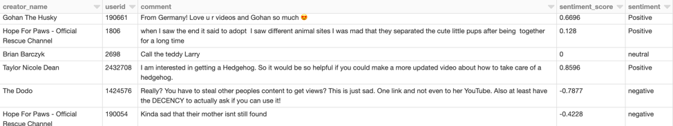
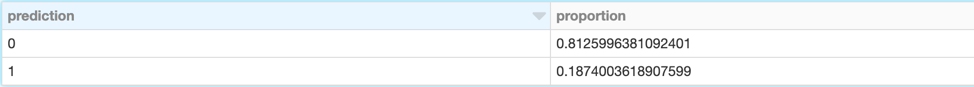
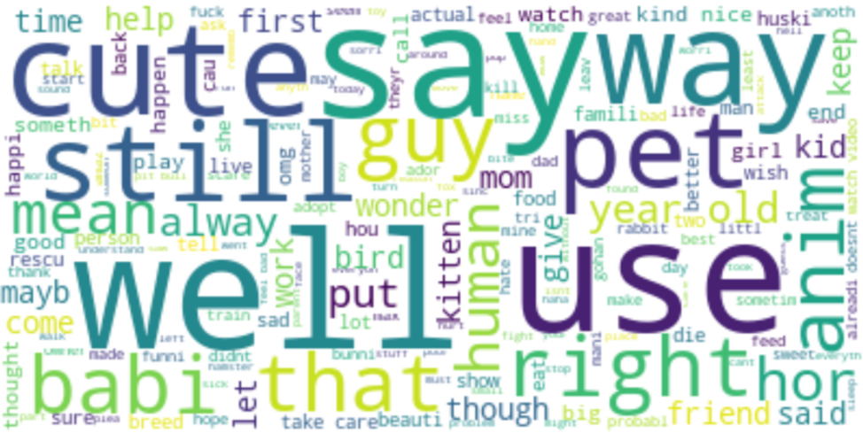
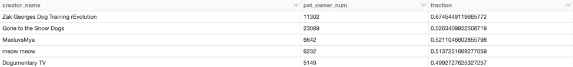

# Youtube-data-analysis

In this project, I applied 5.8 million Youtube comments dataset of videos about pets to do **semantic analysis** and **recommendation to pet owner users**.  
[Notebook](https://github.com/XinkaiWang515/Youtube-data-analysis/blob/master/Spark_Youtube_data_analysis.ipynb)  

1. **Filtered non-English comments out** and applied Vader **Sentiment Analysis** to classify the comments to Positive, Neutral and Negative.  
  
.  

2. **Labelled comments which are from pet owner users** (label 1) by keywords like "my dog", "my cat", "I have a kitty" and extracted around 40,000 label 1 data. Added 40,000 label 0 data and splitted them into train and test dataset.
3. Built pipeline including tokenizer, stopword remover and word2Vec to **transform comments to numeric vector features**.
4. Trained classification models including Logistic Regression, Random Forest and Gradient Boosting and tuned their parameters via cross validation. Compared these classfication models and obtained the best performance model random forest with 93% accuracy. 
5. Applied random forest model to rest data to **classify comments from pet owner users, which were around 18.7% among all**.  
  
.  

6. **Extracted main topic of comments from pet owner users**, the most important words including "cat", "dog", "like", "cute" which didn't contain much useful information. I also tried added those words to stopwords, but still could not find interesting content words. This part needs further exploration.  
  
Here are some high-frequency words in comments from pet owner users:  
.

7. Found video creators with more than 10,000 comments, "Zak Georges Dog Training rEvolution", "MaxluvsMya", "Lennon The Bunny" are top 3 creator with **highest fraction of commented by pet owner users**. Also obtained video creators received more than 1000 comments from pet owner users with **top positive comment rate**. For instance, the top 3 creators 'Cute Cats Kwazi and Uli', 'Thor Unleashed' and 'Schnauzer Mom' received respetively 86.8%, 83.8% and 78.7% Positive comments from pet owner users. These creators can be **recommended to users interested in pets**.
  
.
